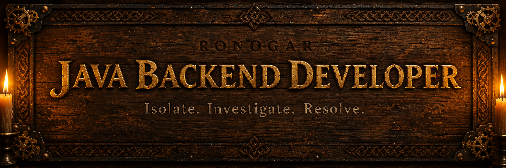

  

# Hey, I'm Ronogar 👋

Backend developer in training, based in Argentina. Learning Java and Spring Boot,
building real projects instead of just following tutorials, and getting ready
for my first job as a backend dev.

## 🔭 What I'm working on

**[appointment-system](https://github.com/Rong-ARG/appointment-system)** — a REST API for scheduling
appointments between clients and professionals. Built with Java 21, Spring Boot,
Spring Data JPA, MySQL, and Spring Security + JWT. I use it as my main practice
project: adding features, then going back and hunting for bugs (found and fixed
a few real authorization issues in there — check the README for details).

## 🧰 Tech I use

**Backend:** Java · Spring Boot · Spring Data JPA · Spring Security · JWT
**Validation & tooling:** Jakarta Validation · Lombok · MySQL · Docker
**Learning next:** Flyway migrations · JUnit testing

## 🌱 How I work

- I like understanding the "why" behind a fix
- I review my own code for bugs and security issues before calling something done
- Comfortable breaking down a problem, researching it, and coming back with a clear answer

## 📫 Find me

- GitHub: [@Rong-ARG](https://github.com/Rong-ARG)

---
*Currently open to backend / junior developer opportunities.*
